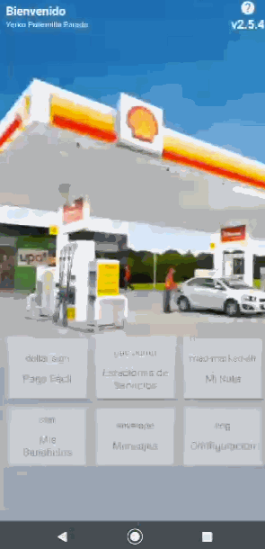

# IonixTechTest

Repository corresponding to the Ionix Tech Test.

> What are the features?

* Displays a list of items from the server
* DialogFragment, to enter a rut and then validate it
* This application stores data locally
* Use of [Retrofit2](https://square.github.io/retrofit/) and [Gson](https://github.com/square/retrofit/tree/master/retrofit-converters/gson) to parse and request data from the REST API.

## Preview

## Stack

* [Room](https://developer.android.com/topic/libraries/architecture/room)
* [Retrofit2](https://square.github.io/retrofit/)
* [Dagger2](https://dagger.dev)
* [Gson](https://github.com/square/retrofit/tree/master/retrofit-converters/gson)
* Among others...

## License

* [Apache 2.0](http://www.apache.org/licenses/LICENSE-2.0.html)
* [Maven](https://maven.apache.org/)

## Authors

* **Yerko Pailemilla Parada** - *Developer* - [LinkedIn](https://www.linkedin.com/in/yerko-pailemilla-parada-776538126/)
